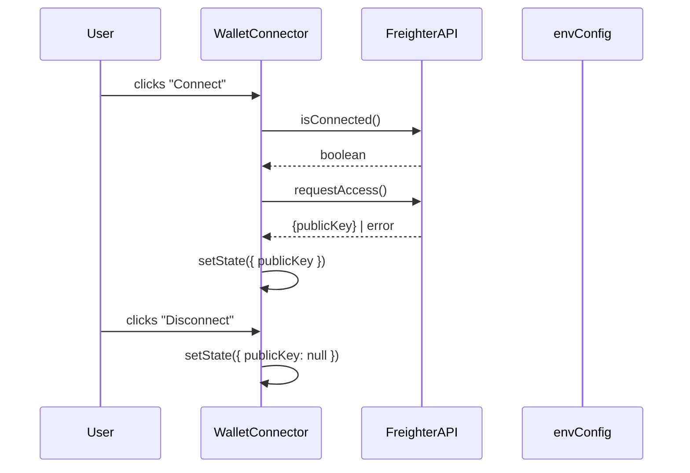

# Design Document: frontend-bootstrap

## Overview

The `frontend-bootstrap` feature establishes the foundational React + TypeScript layer for the
QuorumProof application. It replaces the current placeholder `App.tsx` with a real application
shell that includes:

- A typed environment configuration module (`envConfig.ts`)
- A `WalletConnector` React component backed by `@stellar/freighter-api`
- A `NetworkIndicator` React component that reads from `EnvConfig`
- A top-level `App.tsx` that composes the header, wallet connector, and network indicatorDescription:
Bootstrap the frontend application with Vite, React, and Stellar wallet connectivity. This is the foundational layer all other frontend features depend on.

Tasks:

Scaffold Vite + React + TypeScript project under frontend/
Integrate @stellar/freighter-api for wallet connection
Set up environment variable handling from .env (VITE_STELLAR_NETWORK, VITE_STELLAR_RPC_URL)
Add wallet connect/disconnect button with address display
Add network indicator (testnet/mainnet/futurenet) sourced from environments.toml values

The existing `stellar.js` read-only RPC layer and the vanilla-JS pages (`dashboard.js`,
`verify.js`, `main.js`) are **out of scope** for this feature and remain unchanged. The bootstrap
layer only provides the React shell that future features will build on top of.

### Design Goals

1. Keep the surface area minimal — only what is needed for wallet connect/disconnect and network
   display.
2. Maintain strict TypeScript throughout new files; do not touch existing `.js` files.
3. Rely on `@stellar/freighter-api` for all wallet interactions; no custom wallet logic.
4. Source all network configuration from a single `envConfig.ts` module so downstream code has
   one import point.

---

## Architecture

```mermaid
graph TD
    A[main.tsx] --> B[App.tsx]
    B --> C[Header]
    C --> D[NetworkIndicator]
    C --> E[WalletConnector]
    E --> F[@stellar/freighter-api]
    D --> G[envConfig.ts]
    E --> G
    G --> H[import.meta.env / Vite]
```

The application entry point (`main.tsx`) mounts `App`. `App` renders a persistent `Header` that
always contains `NetworkIndicator` and `WalletConnector`. Both components read from `envConfig.ts`
for network values; `WalletConnector` additionally calls Freighter API methods.

### Data Flow



---

## Components and Interfaces

### `envConfig.ts`

A pure module (no React) that reads Vite env vars and exports a typed config object.

```ts
export type StellarNetwork = 'testnet' | 'mainnet' | 'futurenet' | 'standalone';

export interface EnvConfig {
  network: StellarNetwork;
  rpcUrl: string;
}

export const VALID_NETWORKS: StellarNetwork[] = ['testnet', 'mainnet', 'futurenet', 'standalone'];

export const envConfig: EnvConfig;
```

**Defaulting rules:**
- `VITE_STELLAR_NETWORK` absent → `"testnet"`
- `VITE_STELLAR_NETWORK` set to an unrecognised value → `"testnet"` + `console.warn`
- `VITE_STELLAR_RPC_URL` absent → `"https://soroban-testnet.stellar.org"`

### `NetworkIndicator` component

Props: none (reads `envConfig` directly).

Renders a `<span>` badge in the header showing the human-readable network label. Applies a
distinct CSS class when the network is `"mainnet"` to visually warn users.

| `network` value | Displayed label | CSS modifier class |
|---|---|---|
| `testnet` | Testnet | `network-badge--testnet` |
| `mainnet` | Mainnet | `network-badge--mainnet` (warning style) |
| `futurenet` | Futurenet | `network-badge--futurenet` |
| `standalone` | Standalone | `network-badge--standalone` |

### `WalletConnector` component

Props: none (self-contained state).

Internal state:

```ts
type WalletState =
  | { status: 'disconnected' }
  | { status: 'connecting' }
  | { status: 'connected'; publicKey: string }
  | { status: 'error'; message: string };
```

Rendered output per state:

| State | UI |
|---|---|
| `disconnected` | "Connect Wallet" button (enabled) |
| `connecting` | Loading spinner + "Connecting…" button (disabled) |
| `connected` | PublicKey in `<code>` (monospace) + "Disconnect" button |
| `error` | Error message + "Connect Wallet" button (enabled) |

If Freighter is not installed (`isConnected` throws or `requestAccess` returns an error
indicating the extension is absent), the component renders a "Freighter extension required"
message instead of the connect button.

### `App.tsx`

Composes the application shell:

```tsx
<>
  <header className="app-header">
    <span className="app-logo">⬡ QuorumProof</span>
    <NetworkIndicator />
    <WalletConnector />
  </header>
  <main>{/* future route content */}</main>
</>
```

---

## Data Models

### `EnvConfig`

```ts
interface EnvConfig {
  network: 'testnet' | 'mainnet' | 'futurenet' | 'standalone';
  rpcUrl: string;
}
```

Constructed once at module load time; immutable at runtime.

### `WalletState`

```ts
type WalletState =
  | { status: 'disconnected' }
  | { status: 'connecting' }
  | { status: 'connected'; publicKey: string }
  | { status: 'error'; message: string };
```

Held in `WalletConnector` local React state via `useState<WalletState>`.

### Network label map

```ts
const NETWORK_LABELS: Record<StellarNetwork, string> = {
  testnet:    'Testnet',
  mainnet:    'Mainnet',
  futurenet:  'Futurenet',
  standalone: 'Standalone',
};
```

---


## Correctness Properties

*A property is a characteristic or behavior that should hold true across all valid executions of a
system — essentially, a formal statement about what the system should do. Properties serve as the
bridge between human-readable specifications and machine-verifiable correctness guarantees.*

### Property 1: EnvConfig always produces a valid network

*For any* string value supplied as `VITE_STELLAR_NETWORK` (including absent / undefined), the
`envConfig.network` field SHALL always be one of `"testnet"`, `"mainnet"`, `"futurenet"`, or
`"standalone"`. When the supplied value is not in that set, the result SHALL be `"testnet"`.

**Validates: Requirements 3.1, 3.4**

---

### Property 2: NetworkIndicator label mapping

*For any* valid `StellarNetwork` value (`testnet`, `mainnet`, `futurenet`, `standalone`), the
`NetworkIndicator` component SHALL render the corresponding human-readable label (`"Testnet"`,
`"Mainnet"`, `"Futurenet"`, `"Standalone"` respectively).

**Validates: Requirements 6.2, 6.3, 6.4, 6.5**

---

### Property 3: Connected wallet renders full key in monospace

*For any* Stellar public key string returned by Freighter, the `WalletConnector` in the
`connected` state SHALL render the complete, untruncated key inside a monospace element (e.g.
`<code>`).

**Validates: Requirements 5.1, 5.3**

---

### Property 4: Connect then disconnect returns to disconnected state

*For any* public key returned by a successful Freighter `requestAccess` call, clicking the
disconnect button SHALL result in the `WalletConnector` returning to the `disconnected` state
with no public key displayed.

**Validates: Requirements 4.3**

---

### Property 5: Freighter error message is surfaced verbatim

*For any* error message string returned by Freighter during a connection attempt, the
`WalletConnector` SHALL display that exact error string to the user.

**Validates: Requirements 4.6**

---

### Property 6: NetworkIndicator is always present regardless of wallet state

*For any* `WalletState` value (`disconnected`, `connecting`, `connected`, `error`), the
`NetworkIndicator` SHALL be rendered inside the application header.

**Validates: Requirements 6.7**

---

## Error Handling

### Freighter not installed

`requestAccess()` from `@stellar/freighter-api` throws or returns an error object when the
extension is absent. `WalletConnector` catches this and transitions to a special
`"not-installed"` branch that renders a static message: "Freighter extension is required."
No retry button is shown; the user must install the extension and reload.

### Freighter permission rejected

`requestAccess()` returns an error with a user-rejection message. `WalletConnector` transitions
to `{ status: 'error', message: <rejection message> }` and renders the message alongside a
re-enabled "Connect Wallet" button so the user can try again.

### Unknown Freighter errors

Any other error from `requestAccess()` is caught and its `.message` (or a generic fallback
`"Connection failed"`) is stored in `WalletState.error` and displayed.

### Invalid `VITE_STELLAR_NETWORK`

`envConfig.ts` logs `console.warn('Unknown VITE_STELLAR_NETWORK value "<x>"; falling back to testnet')`
and returns `"testnet"`. This is a developer-facing warning only; the UI continues to function.

---

## Testing Strategy

### Dual Testing Approach

Both unit tests and property-based tests are used. Unit tests cover specific examples, edge
cases, and integration points. Property-based tests verify universal invariants across many
generated inputs.

### Unit Tests (Vitest + React Testing Library)

- `envConfig.ts`
  - Returns `"testnet"` when `VITE_STELLAR_NETWORK` is absent
  - Returns the correct default RPC URL when `VITE_STELLAR_RPC_URL` is absent
  - Returns the supplied RPC URL when `VITE_STELLAR_RPC_URL` is set
  - `.env.example` contains all required `VITE_` keys (file-read example test)
  - `package.json` declares `@stellar/freighter-api` as a dependency (file-read example test)

- `WalletConnector`
  - Renders "Connect Wallet" button in disconnected state
  - Calls `requestAccess` when connect button is clicked (mock Freighter)
  - Shows loading indicator and disabled button while connecting (pending promise mock)
  - Shows "Freighter extension required" when Freighter is absent
  - Shows error message and re-enabled button when user rejects permission
  - Displays no address in disconnected state

- `NetworkIndicator`
  - Applies `network-badge--mainnet` CSS class when network is `"mainnet"`

### Property-Based Tests (fast-check)

Each property test runs a minimum of **100 iterations**. Each test is tagged with a comment
referencing the design property it validates.

```
// Feature: frontend-bootstrap, Property N: <property text>
```

- **Property 1** — `envConfig` network validity
  Generate arbitrary strings (including empty string, whitespace, numbers, valid values) as
  `VITE_STELLAR_NETWORK`. Assert the returned `network` is always one of the four valid values.

- **Property 2** — `NetworkIndicator` label mapping
  For each of the four valid `StellarNetwork` values, render `NetworkIndicator` with that
  network injected and assert the rendered text matches the expected label. (Exhaustive over
  the finite domain; fast-check `fc.constantFrom` is used.)

- **Property 3** — Connected wallet renders full key in monospace
  Generate arbitrary Stellar-like public key strings (56-char base32). Mock Freighter to return
  the key. Render `WalletConnector` in connected state. Assert the full key appears inside a
  `<code>` element.

- **Property 4** — Connect then disconnect round trip
  Generate arbitrary public keys. Mock Freighter to return the key. Simulate connect then
  disconnect. Assert the component is in disconnected state with no key visible.

- **Property 5** — Freighter error message surfaced verbatim
  Generate arbitrary error message strings. Mock Freighter `requestAccess` to reject with that
  message. Assert the rendered output contains the exact message string.

- **Property 6** — NetworkIndicator always present
  For each `WalletState` variant, render `App` with that state injected. Assert the
  `NetworkIndicator` element is present in the DOM.

**Property-based testing library:** `fast-check` (npm package `fast-check`).
Each property test must be a single `fc.assert(fc.property(...))` call referencing the design
property in a comment above it.
