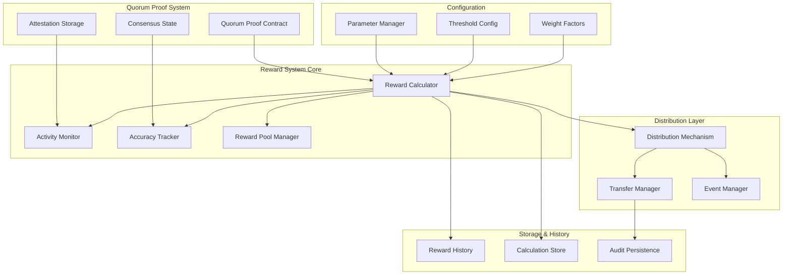

# Design Document: Member Rewards System

## Overview

The member rewards system provides a comprehensive framework for calculating and distributing rewards to active and accurate slice members within the quorum proof system. The design emphasizes fairness, transparency, and resistance to gaming while incentivizing quality participation through activity and accuracy-based metrics.

The system operates on configurable reward periods, during which member contributions are measured and scored. Rewards are calculated using a multi-factor approach that considers attestation frequency, accuracy rates, consensus participation, and applies configurable weighting factors. The distribution mechanism ensures atomic transfers and maintains complete audit trails.

Key design principles include:
- **Fairness**: Equal opportunity for all members to earn rewards based on contribution
- **Transparency**: Complete visibility into calculation methods and historical records
- **Gaming Resistance**: Multiple layers of protection against manipulation attempts
- **Configurability**: Administrative control over reward parameters and thresholds
- **Auditability**: Immutable records and deterministic calculations

## Architecture

The member rewards system integrates with the existing quorum proof smart contract system through several key components:



### Component Responsibilities

**Reward Calculator**: Central orchestrator that computes member rewards by aggregating activity scores, accuracy metrics, and applying configured weights and thresholds.

**Activity Monitor**: Tracks attestation frequency, timing, and cross-slice participation. Implements decay factors for temporal weighting and normalization to prevent gaming.

**Accuracy Tracker**: Monitors attestation accuracy based on consensus outcomes and challenge results. Maintains accuracy histories and calculates bonus multipliers.

**Distribution Mechanism**: Handles atomic reward transfers, manages insufficient pool scenarios through proportional scaling, and emits comprehensive distribution events.

**Reward Pool Manager**: Maintains pool balance, prevents over-distribution, and provides administrative functions for pool management.

## Components and Interfaces

### Core Reward Calculator Interface

```rust
pub trait RewardCalculator {
    /// Calculate rewards for a specific member over a reward period
    fn calculate_member_rewards(
        &self,
        member: Address,
        period: RewardPeriod,
        pool_size: U256
    ) -> Result<RewardCalculation, RewardError>;
    
    /// Preview reward calculations without committing
    fn preview_rewards(
        &self,
        members: Vec<Address>,
        period: RewardPeriod,
        pool_size: U256
    ) -> Result<Vec<RewardPreview>, RewardError>;
    
    /// Get detailed calculation breakdown for transparency
    fn get_calculation_breakdown(
        &self,
        member: Address,
        period: RewardPeriod
    ) -> Result<CalculationBreakdown, RewardError>;
}
```

### Activity Scoring Interface

```rust
pub trait ActivityScorer {
    /// Calculate activity score for a member in a period
    fn calculate_activity_score(
        &self,
        member: Address,
        period: RewardPeriod
    ) -> Result<ActivityScore, ScoringError>;
    
    /// Apply temporal decay to attestation weights
    fn apply_temporal_decay(
        &self,
        attestations: Vec<Attestation>,
        decay_factor: f64
    ) -> Vec<WeightedAttestation>;
    
    /// Normalize scores to prevent gaming
    fn normalize_activity_scores(
        &self,
        raw_scores: Vec<(Address, u64)>
    ) -> Vec<(Address, ActivityScore)>;
}
```

### Accuracy Tracking Interface

```rust
pub trait AccuracyTracker {
    /// Calculate accuracy score based on consensus alignment
    fn calculate_accuracy_score(
        &self,
        member: Address,
        period: RewardPeriod
    ) -> Result<AccuracyScore, AccuracyError>;
    
    /// Update accuracy based on consensus outcome
    fn update_accuracy_from_consensus(
        &mut self,
        attestation_id: U256,
        consensus_result: ConsensusResult
    ) -> Result<(), AccuracyError>;
    
    /// Apply accuracy bonuses for consistent performance
    fn calculate_accuracy_bonus(
        &self,
        accuracy_history: AccuracyHistory
    ) -> AccuracyBonus;
}
```

### Distribution Interface

```rust
pub trait RewardDistributor {
    /// Distribute calculated rewards to members
    fn distribute_rewards(
        &mut self,
        rewards: Vec<(Address, U256)>,
        pool_balance: U256
    ) -> Result<DistributionResult, DistributionError>;
    
    /// Handle insufficient pool through proportional scaling
    fn scale_rewards_proportionally(
        &self,
        rewards: Vec<(Address, U256)>,
        available_pool: U256
    ) -> Vec<(Address, U256)>;
    
    /// Emit distribution events for transparency
    fn emit_distribution_events(
        &self,
        distributions: Vec<RewardDistribution>
    ) -> Result<(), EventError>;
}
```

## Data Models

### Core Reward Structures

```rust
#[derive(Debug, Clone, Serialize, Deserialize)]
pub struct RewardCalculation {
    pub member: Address,
    pub period: RewardPeriod,
    pub activity_score: ActivityScore,
    pub accuracy_score: AccuracyScore,
    pub base_reward: U256,
    pub accuracy_bonus: U256,
    pub final_reward: U256,
    pub calculation_timestamp: u64,
}

#[derive(Debug, Clone, Serialize, Deserialize)]
pub struct ActivityScore {
    pub attestation_count: u64,
    pub cross_slice_multiplier: f64,
    pub temporal_weight: f64,
    pub normalized_score: f64,
    pub meets_minimum_threshold: bool,
}

#[derive(Debug, Clone, Serialize, Deserialize)]
pub struct AccuracyScore {
    pub correct_attestations: u64,
    pub total_attestations: u64,
    pub accuracy_rate: f64,
    pub consensus_alignment_bonus: f64,
    pub challenge_success_rate: f64,
    pub accuracy_bonus_multiplier: f64,
}

#[derive(Debug, Clone, Serialize, Deserialize)]
pub struct RewardPeriod {
    pub start_timestamp: u64,
    pub end_timestamp: u64,
    pub period_id: U256,
}

#[derive(Debug, Clone, Serialize, Deserialize)]
pub struct RewardConfiguration {
    pub activity_weight: f64,
    pub accuracy_weight: f64,
    pub minimum_activity_threshold: u64,
    pub accuracy_bonus_multiplier: f64,
    pub temporal_decay_factor: f64,
    pub cross_slice_bonus: f64,
    pub gaming_penalty_factor: f64,
}
```

### Historical and Audit Structures

```rust
#[derive(Debug, Clone, Serialize, Deserialize)]
pub struct RewardHistory {
    pub member: Address,
    pub rewards: Vec<RewardCalculation>,
    pub total_earned: U256,
    pub periods_participated: u64,
    pub average_accuracy: f64,
}

#[derive(Debug, Clone, Serialize, Deserialize)]
pub struct CalculationBreakdown {
    pub member: Address,
    pub period: RewardPeriod,
    pub raw_activity_count: u64,
    pub temporal_weighted_activity: f64,
    pub normalized_activity_score: f64,
    pub accuracy_metrics: AccuracyMetrics,
    pub applied_weights: RewardConfiguration,
    pub intermediate_calculations: Vec<CalculationStep>,
    pub final_reward: U256,
}

#[derive(Debug, Clone, Serialize, Deserialize)]
pub struct DistributionResult {
    pub total_distributed: U256,
    pub successful_transfers: u64,
    pub failed_transfers: Vec<(Address, DistributionError)>,
    pub pool_balance_after: U256,
    pub distribution_timestamp: u64,
}
```

### Gaming Detection Structures

```rust
#[derive(Debug, Clone, Serialize, Deserialize)]
pub struct GamingDetectionResult {
    pub member: Address,
    pub gaming_indicators: Vec<GamingIndicator>,
    pub risk_score: f64,
    pub recommended_penalty: Option<Penalty>,
}

#[derive(Debug, Clone, Serialize, Deserialize)]
pub enum GamingIndicator {
    ExcessiveAttestationRate { rate: f64, threshold: f64 },
    CoordinatedBehavior { correlated_members: Vec<Address> },
    LowValueSpamming { avg_attestation_value: f64 },
    SuspiciousAccuracyPattern { pattern_description: String },
}

#[derive(Debug, Clone, Serialize, Deserialize)]
pub struct Penalty {
    pub penalty_type: PenaltyType,
    pub severity: f64,
    pub duration_periods: u64,
    pub reward_reduction_factor: f64,
}
```

## Correctness Properties

*A property is a characteristic or behavior that should hold true across all valid executions of a system-essentially, a formal statement about what the system should do. Properties serve as the bridge between human-readable specifications and machine-verifiable correctness guarantees.*

### Property 1: Core Reward Calculation Completeness

*For any* valid member and reward period, when calculate_member_rewards is called, the result should include both activity and accuracy components with all configured factors applied.

**Validates: Requirements 1.2, 1.4, 1.5**

### Property 2: Attestation Count Tracking Isolation

*For any* member and set of reward periods, attestation counts should be correctly tracked and isolated per period without cross-contamination.

**Validates: Requirements 2.1**

### Property 3: Temporal Decay Weighting

*For any* set of attestations with different timestamps, more recent attestations should contribute higher weights to the final activity score than older ones.

**Validates: Requirements 2.2**

### Property 4: Cross-Slice Activity Aggregation

*For any* member with attestations across multiple slices, the total activity score should properly aggregate contributions from all slices.

**Validates: Requirements 2.3**

### Property 5: Activity Normalization Anti-Gaming

*For any* member with excessive low-value attestations, the normalized activity score should not increase linearly with attestation count.

**Validates: Requirements 2.4**

### Property 6: Minimum Activity Threshold Enforcement

*For any* member with activity below the configured minimum threshold, the calculated reward should be zero.

**Validates: Requirements 2.5**

### Property 7: Accuracy Tracking from Consensus

*For any* attestation with a known consensus outcome, the accuracy score should correctly reflect whether the attestation aligned with or conflicted with the final consensus.

**Validates: Requirements 3.1, 3.2, 3.3**

### Property 8: Challenge Outcome Integration

*For any* attestation that underwent a challenge process, the challenge outcome should be properly incorporated into the accuracy score calculation.

**Validates: Requirements 3.4**

### Property 9: Accuracy Bonus for Consistency

*For any* member with consistently high accuracy rates over multiple periods, the accuracy bonus multiplier should be greater than the base multiplier.

**Validates: Requirements 3.5**

### Property 10: Atomic Distribution Guarantee

*For any* reward distribution operation, either all transfers succeed or all transfers fail, with no partial distribution states.

**Validates: Requirements 4.3**

### Property 11: Distribution Event Emission

*For any* successful reward transfer, a corresponding distribution event should be emitted with complete transfer details.

**Validates: Requirements 4.4**

### Property 12: Proportional Pool Scaling

*For any* reward distribution where calculated rewards exceed available pool, all individual rewards should be scaled by the same proportional factor.

**Validates: Requirements 4.5, 5.3**

### Property 13: Pool Balance Protection

*For any* reward distribution operation, the total distributed amount should never exceed the available reward pool balance.

**Validates: Requirements 5.2, 9.2**

### Property 14: Configuration Temporal Isolation

*For any* configuration parameter change, the change should only affect reward calculations for periods starting after the change timestamp.

**Validates: Requirements 6.5**

### Property 15: Reward History Immutability

*For any* reward record once written to history, the record should remain unchanged and verifiable across all future queries.

**Validates: Requirements 7.5**

### Property 16: History Completeness

*For any* reward calculation performed, all required details (activity score, accuracy score, final amount) should be included in the stored reward record.

**Validates: Requirements 7.3**

### Property 17: Rate Limiting Enforcement

*For any* member exceeding the configured attestation rate limit, additional attestations should be rejected or penalized.

**Validates: Requirements 8.1**

### Property 18: Gaming Detection and Penalties

*For any* detected coordinated gaming behavior, appropriate penalties should be applied to the involved members' rewards.

**Validates: Requirements 8.2, 8.5**

### Property 19: Diminishing Returns Application

*For any* member with excessive activity levels, the marginal reward per additional attestation should decrease as activity increases.

**Validates: Requirements 8.3**

### Property 20: Eligibility Threshold Enforcement

*For any* member below minimum stake or reputation thresholds, the member should be excluded from reward calculations entirely.

**Validates: Requirements 8.4**

### Property 21: Reward Calculation Invariants

*For any* reward calculation, individual rewards should be non-negative and the sum of all rewards should not exceed the available pool.

**Validates: Requirements 9.2**

### Property 22: Calculation Breakdown Completeness

*For any* reward calculation breakdown request, the response should include all factors, weights, and intermediate calculation steps used.

**Validates: Requirements 10.2**

### Property 23: Audit Logging Completeness

*For any* reward calculation performed, all calculation parameters and intermediate values should be logged for audit purposes.

**Validates: Requirements 10.4**

### Property 24: Calculation Determinism

*For any* identical set of inputs (member, period, configuration), the reward calculation should always produce identical outputs.

**Validates: Requirements 10.5**

## Error Handling

The member rewards system implements comprehensive error handling across all components:

### Calculation Errors

**Invalid Input Handling**: All calculation functions validate inputs and return appropriate errors for invalid members, periods, or configurations. Zero rewards are returned for non-existent members rather than throwing exceptions.

**Numerical Overflow Protection**: All arithmetic operations include overflow checks, particularly for reward calculations involving large numbers or accumulated values over time.

**Configuration Validation**: Parameter updates are validated for reasonable ranges and consistency before application. Invalid configurations are rejected with descriptive error messages.

### Distribution Errors

**Insufficient Pool Handling**: When reward pools are insufficient, the system gracefully scales rewards proportionally rather than failing. This ensures fair distribution even under resource constraints.

**Transfer Failure Recovery**: Failed individual transfers trigger atomic rollback of the entire distribution batch. Partial distributions are prevented through transaction-level atomicity.

**Event Emission Failures**: Distribution events are emitted as part of the same transaction as transfers, ensuring consistency between state changes and event logs.

### Storage and History Errors

**Storage Failure Handling**: Reward history storage failures trigger transaction rollback to maintain consistency between calculated rewards and recorded history.

**Query Error Recovery**: History and statistics queries implement graceful degradation, returning partial results when possible and clear error messages when data is unavailable.

**Audit Trail Integrity**: Any failure in audit logging triggers transaction rollback to ensure complete audit trails are maintained.

### Gaming Detection Errors

**False Positive Mitigation**: Gaming detection algorithms include confidence thresholds and human review processes for high-impact penalties to prevent false positives.

**Detection System Failures**: If gaming detection systems fail, the system defaults to standard reward calculations rather than blocking all rewards.

**Penalty Application Errors**: Failed penalty applications are logged and queued for retry rather than blocking the entire reward distribution process.

## Testing Strategy

The member rewards system employs a comprehensive dual testing approach combining unit tests for specific scenarios with property-based tests for universal correctness guarantees.

### Unit Testing Approach

**Specific Example Coverage**: Unit tests focus on concrete examples that demonstrate correct behavior, including edge cases like zero activity, perfect accuracy, and boundary conditions.

**Integration Point Testing**: Tests verify correct integration between reward calculation, distribution, and storage components through complete workflow scenarios.

**Error Condition Testing**: Comprehensive coverage of error scenarios including invalid inputs, insufficient pools, and system failures.

**Configuration Testing**: Verification that administrative functions correctly update system parameters and that changes apply only to future calculations.

### Property-Based Testing Framework

**Library Selection**: Implementation uses the `proptest` crate for Rust-based property testing, providing robust random input generation and shrinking capabilities.

**Test Configuration**: Each property test runs a minimum of 100 iterations to ensure comprehensive input coverage through randomization.

**Property Implementation**: Each correctness property from the design document is implemented as a single property-based test with clear traceability.

**Test Tagging**: All property tests include comments with the format: **Feature: member-rewards, Property {number}: {property_text}** for clear traceability to design requirements.

### Comprehensive Test Coverage

**Invariant Testing**: Property tests verify critical system invariants including reward non-negativity, pool balance protection, and calculation determinism.

**Randomized Input Testing**: Property tests generate random valid inputs to verify system behavior across the entire input space, catching edge cases that might be missed in unit tests.

**Gaming Scenario Testing**: Specialized tests simulate various gaming attempts to verify anti-gaming mechanisms work correctly under adversarial conditions.

**Performance Validation**: Load testing with high member counts ensures the system maintains acceptable performance characteristics under realistic usage patterns.

### Test Data Management

**Deterministic Test Data**: Unit tests use fixed, well-understood test data to ensure reproducible results and clear failure diagnosis.

**Random Data Generation**: Property tests use structured random data generators that produce valid but varied inputs while maintaining realistic constraints.

**Historical Data Testing**: Tests include scenarios with extensive reward histories to verify long-term system behavior and storage efficiency.

The dual testing approach ensures both concrete correctness (unit tests) and universal correctness (property tests), providing comprehensive validation of the member rewards system's behavior across all possible inputs and scenarios.